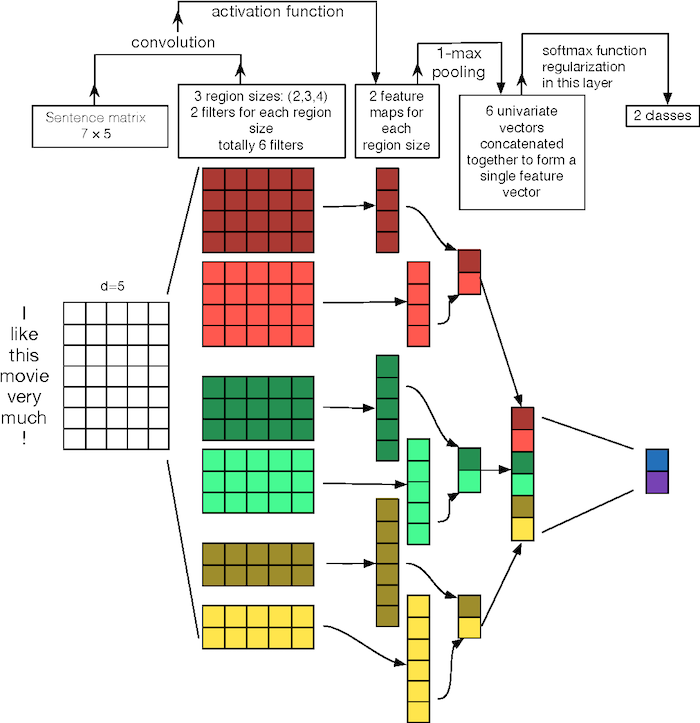

# Text CNN
---
PyTorch implementation of [Convolutional Neural Networks for Sentence Classification](https://www.aclweb.org/anthology/D14-1181)  
This is Baseline model for multi-senti classification task  

- Illustration of a CNN architecture for sentence classification  
  

## Description

Gensim으로 학습된 Word2Vec 파일을 받아 1d-CNN을 수행합니다.  

## Requirements

- python 3.7
- sentencepiece==0.1.83
- pytorch==1.1
- torchvision==0.4.0
- tb-nightly==1.15
- gensim
- tqdm

## config
```yml
    tokenizer_path = 'data/m32k.model'
    vocab_path = 'data/m32k.vocab'
    w2v_path = 'w2v_pretrained'
    trainpath = './data/korean_single_train.csv'
    devpath = './data/korean_single_dev.csv'
    model_dir = 'model'

    num_classes = 7
    vocab_size = 32000
    embedding_size = 150
    epoch = 50
    batch_size = 256
    max_grad_norm = 5

    summary_step = 50
```

## Result

To be updated  


## Reference

[Convolutional Neural Networks for Sentence Classification](https://www.aclweb.org/anthology/D14-1181)

